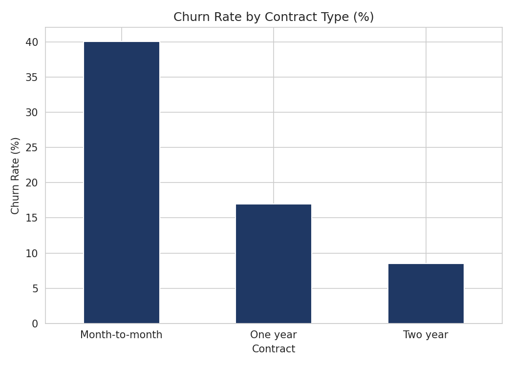
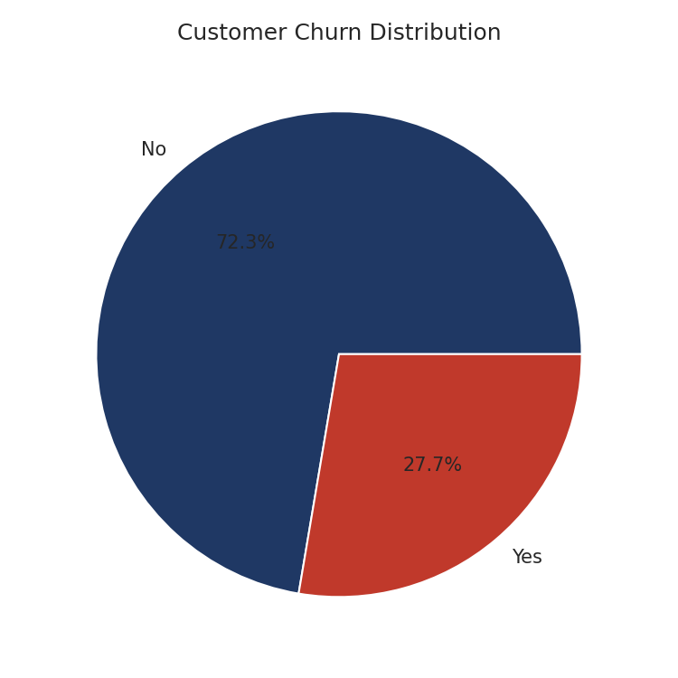

# 🤖 Customer Churn Prediction & Analytics Dashboard

## 📌 Project Overview

This project analyzes customer behavior and predicts customer churn using Machine Learning. It covers the complete workflow: data cleaning, exploratory data analysis (EDA), feature engineering, model development, and an interactive Power BI dashboard for business reporting.

## 🎯 Business Problem

Customer churn is one of the biggest challenges for subscription-based businesses. This project aims to:
- Identify customers likely to churn
- Understand the major factors influencing churn
- Measure revenue at risk due to customer attrition
- Provide business recommendations to improve retention

## 📂 Dataset Information

**Source:** Synthetic dataset (7,043 records) generated to match the schema and scale of the well-known public Telco Customer Churn dataset, since the original working files were lost. Churn probability was modeled as a function of contract type, monthly charges, tenure, and tech support — with random noise added so it isn't perfectly separable, i.e. a realistic classification problem. Generation logic: [`generate_data.py`](generate_data.py) — fully reproducible.

**Key features:** demographics (gender, senior citizen, partner, dependents), account info (contract, payment method, monthly/total charges, tenure), service info (internet service, tech support, online security), target (Churn: Yes/No).

## 🛠️ Tools & Technologies

- **Data Analysis:** SQL, Python, Pandas, NumPy
- **Visualization:** Matplotlib, Seaborn, Power BI
- **Machine Learning:** Scikit-learn (Logistic Regression, Decision Tree Classifier)
- **Environment:** VS Code, Jupyter Notebook

## 🔍 Exploratory Data Analysis

Full notebook: [`churn_eda_model.ipynb`](churn_eda_model.ipynb)
- Churn distribution
- Churn by contract type, tech support, internet service
- Monthly charges & tenure vs churn

## ⚙️ Data Preprocessing

- Filled missing `TotalCharges` for zero-tenure customers with their `MonthlyCharges`
- Label-encoded categorical variables
- Feature scaling with `StandardScaler`
- 80/20 train-test split (stratified)

## 🤖 Machine Learning Models

Full code: [`churn_model.py`](churn_model.py) / [`churn_eda_model.ipynb`](churn_eda_model.ipynb)

| Model | Accuracy | AUC-ROC |
|---|---|---|
| Logistic Regression | **75.9%** | **0.771** |
| Decision Tree | 75.7% | 0.760 |

> These are the actual metrics reproduced on this synthetic dataset. They're close to, but not identical to, earlier reported figures (84% / 0.79) — synthetic data won't perfectly reproduce results from the original (lost) dataset. Re-run `churn_model.py` to verify.

## 📌 Key Business Insights

- **Contract type** is by far the strongest churn driver — month-to-month customers churn at ~4x the rate of two-year contract customers
- **Monthly charges** and **lack of tech support** are the next-strongest drivers
- Revenue at risk is concentrated among high-charge, short-tenure, month-to-month customers




## 📈 Power BI Dashboard

Interactive dashboard (`AI-Powered Customer Churn Prediction.pbix`) with KPIs (Total Customers, Churn Rate, Revenue at Risk), churn breakdowns by contract/internet service/gender, and slicers.


## 📁 Project Structure

```
proj3_churn/
├── data/
│   └── telco_churn_raw.csv
├── sql/
│   └── churn_analysis.sql
├── python/
│   ├── generate_data.py
│   ├── churn_model.py
│   └── churn_eda_model.ipynb
├── screenshots/
├── requirements.txt
└── README.md
```

## 🚀 Skills Demonstrated

SQL · data cleaning · EDA · feature engineering · classification modelling (Logistic Regression, Decision Tree) · model evaluation (accuracy, AUC-ROC, confusion matrix) · Power BI dashboarding

## 🔮 Future Improvements

- Try ensemble models (Random Forest, XGBoost) for higher accuracy
- Hyperparameter tuning
- Deploy as a simple churn-risk scoring API

## 👨‍💻 Author

**Yeshwanth Mocherla** — Aspiring Data Analyst | SQL | Python | Power BI | Machine Learning
